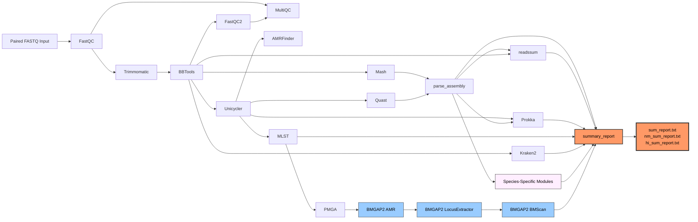

<p align="center">
  
</p>

<p align="center">
  <em>⚠️ For research use only. Results were obtained by procedures that were not CLIA validated.</em>
</p>

<p align="center">
  
  
  
  
</p>

## 🦠🧬 Overview

Sanibel is Florida BPHL's Nextflow bacterial whole-genome sequencing (WGS) analysis pipeline. It performs quality control, *de novo* assembly, species identification, sequence typing and antimicrobial resistance (AMR) detection on paired-end Illumina short reads. 


Species-specific typing modules run automatically based on species identification results: *Legionella pneumophila* (Legsta), *Klebsiella* (Kleborate), *Shigella* (ShigaTyper), *Streptococcus pyogenes/dysgalactiae* (EMM typing), *Salmonella* (SeqSero2), *E. coli* (SerotypeFinder), *Streptococcus pneumoniae* (SeroBA), *Pseudomonas aeruginosa* (pasty), *Acinetobacter baumannii* (Kaptive), *Vibrio parahaemolyticus* (Kaptive), and *Neisseria meningitidis*/*Haemophilus influenzae* (PMGA). BMGAP2 provides enhanced AMR and antigen analysis for *Neisseria meningitidis* and *Haemophilus influenzae*. PlasmidFinder runs on all samples.


### ⚙️ Dependencies

- **Nextflow** ≥ 22.10 — [installation guide](https://github.com/nextflow-io/nextflow)
- **Apptainer/Singularity** — [installation guide](https://apptainer.org/docs/user/latest/)
- **SLURM** workload manager (This applies only if HiPerGator is used)
- **Conda** (for the SANIBEL environment)


### 💻 Resource Requirements

Sanibel can run on any system with Nextflow and Apptainer installed, but is **strongly recommended to run on an HPC environment**. The most resource-intensive step is **Unicycler** (*de novo* assembly via SPAdes), which runs once per sample.

- **CPUs:** 20 recommended (runs 2 assemblies in parallel); minimum 4
- **RAM:** 64 GB recommended; minimum 16 GB
- **Disk:** ~10 GB per sample (input + output); ~8.5 GB for the Kraken2 database (if using minikraken or standard-8 Kraken2 databases)

> **Running locally with fewer CPUs:** Nextflow will still run but your machine will be oversubscribed during assembly. Each Unicycler job requests 10 CPUs by default, on a machine with fewer cores the OS will time-share threads and assembly will complete more slowly but will not fail. You can lower the `cpus` value for `unicycler` in `nextflow.config` to match your hardware.

**Estimated runtime** (12 samples, 20 CPUs, HPC): ~3–4 hours total, dominated by Unicycler (~25 min/sample, 2 running in parallel).


### 🛠️ Setup

#### 1. Create the conda environment

```bash
$ conda create -n SANIBEL -c conda-forge -c bioconda python=3.10 pandas=1.5.3 openpyxl=3.1.5 biopython=1.78 mash=2.3 blast=2.17.0
$ conda activate SANIBEL
```

`pandas`, `openpyxl`, `biopython`, `mash`, and `blast` are required by the BMGAP2 modules (used for Nm/Hi samples).

#### 2. Configure params.yaml

Edit `params.yaml` and set paths for your environment:

```yaml
# Input / Output absolute path, no trailing slash "/"
input:  "/full/path/to/fastqs"
output: "/full/path/to/output"

# non-HiPerGator users: uncomment and set your BMGAP2 analysis_scripts directory
# bmgap2_db:  "/full/path/to/bmgap2/analysis_scripts"

# non-HiPerGator users: uncomment and set your Kraken2 database directory
# kraken_db:  "/full/path/to/kraken2/database"
```

> **HiPerGator users:** only `input` and `output` need to be set. All other paths are pre-configured.

> **Non-HiPerGator users:** uncomment `bmgap2_db` and `kraken_db` by removing the leading `#` and set their paths.

#### 3. Configure sanibel.sh

Set `NXF_APPTAINER_CACHEDIR` to your image cache directory and add your email address for job notifications:

```bash
export NXF_APPTAINER_CACHEDIR=/path/to/apptainer/cache
#SBATCH --mail-user=your@email.gov
```

### BMGAP2 Setup

> **HiPerGator users:** BMGAP2 is already installed and configured on the cluster. The `bmgap2_db` path in `params.yaml` is pre-set. Skip this section entirely.

[BMGAP2](https://github.com/CDCgov/BMGAP2) (*Bacterial Meningitis Genome Analysis Pipeline 2*) runs automatically on every sample. The Python scripts it invokes check the MLST scheme internally and skip any sample that is not *N. meningitidis* or *H. influenzae*.

For non-HiPerGator users, BMGAP2 must be installed before running the pipeline. Its scripts run directly on the host (not inside a container) and are invoked by the three `bmgap2_*` Nextflow modules. Follow the [BMGAP2 installation instructions](https://github.com/CDCgov/BMGAP2) to clone the repository and build all required databases, then set `bmgap2_db` in `params.yaml` to the `analysis_scripts` directory.


### How to Run

Place input FASTQ files in the directory specified by `params.input`. Both Illumina native (`SAMPLE_S1_L001_R1_001.fastq.gz`) and simplified (`SAMPLE_1.fastq.gz`) naming conventions are supported.


### 🐊 HiPerGator Usage
```bash
sbatch sanibel.sh
```

### ⚡ Local Usage
```bash
nextflow run sanibel.nf -profile apptainer -params-file params.yaml
```

### Workflow Diagram



### 🧩 Modules

Sanibel is made possible thanks to the following tools:

<small>

**Quality Control** — [FastQC](https://github.com/s-andrews/FastQC) · [Trimmomatic](https://github.com/usadellab/Trimmomatic) · [BBTools](https://github.com/bbushnell/BBTools) · [MultiQC](https://github.com/MultiQC/MultiQC) · [Lyveset](https://github.com/lskatz/lyve-SET)

**Assembly & Annotation** — [Mash](https://github.com/marbl/Mash) · [Unicycler](https://github.com/rrwick/Unicycler) · [QUAST](https://github.com/ablab/quast) · [Prokka](https://github.com/tseemann/prokka)

**Typing & Classification** — [Kraken2](https://github.com/DerrickWood/kraken2) · [MLST](https://github.com/tseemann/mlst)

**AMR & Mobile Genetic Elements** — [AMRFinderPlus](https://github.com/ncbi/amr) · [PlasmidFinder](https://bitbucket.org/genomicepidemiology/plasmidfinder)

**Species-Specific** — [Legsta](https://github.com/MDU-PHL/legsta) · [Kleborate](https://github.com/klebgenomics/Kleborate) · [ShigaTyper](https://github.com/CFSAN-Biostatistics/shigatyper) · [emm-typing-tool](https://github.com/ukhsa-collaboration/emm-typing-tool) · [SeqSero2](https://github.com/denglab/SeqSero2) · [SerotypeFinder](https://bitbucket.org/genomicepidemiology/serotypefinder) · [PMGA](https://github.com/CDCgov/PMGA) · [BMGAP2](https://github.com/CDCgov/BMGAP2) · [SeroBA](https://github.com/sanger-pathogens/seroba) · [pasty](https://github.com/rpetit3/pasty) · [Kaptive](https://github.com/klebgenomics/Kaptive)

</small>

### 📁 Output

All per-sample results are written to `params.output/<sample_id>/`. Depending on which species are in the run, up to three summary files are written to `params.output/`:

| File | Samples | Cols | Key fields |
|------|---------|------|------------|
| `sum_report.txt` | All | 21 | ID · species (Mash/Kraken) · MLST scheme/ST · serotype · QC metrics (reads, coverage, assembly stats, GC, CDS) |
| `nm_sum_report.txt` | *N. meningitidis* only | 26 | ID · PMGA serogroup · BMGAP2 AMR alleles/phenotypes · vaccine antigen coverage (4CMenB) |
| `hi_sum_report.txt` | *H. influenzae* only | 23 | ID · PMGA capsule type · BMGAP2 AMR alleles/phenotypes |


### 🤝 Contributing
We welcome contributions to make Sanibel better! Feel free to open issues or submit pull requests to suggest any additional features or enhancements!

### 📧 Contact
**Email**: bphl-sebioinformatics@flhealth.gov

### ⚖️ License
Sanibel is licensed under the [Apache License](https://github.com/BPHL-Molecular/Sanibel/blob/main/LICENSE).

[BMGAP2](https://github.com/CDCgov/BMGAP2) is developed by the CDC and is also distributed under the Apache License 2.0. A copy is included in [`licenses/BMGAP2_LICENSE`](licenses/BMGAP2_LICENSE).
