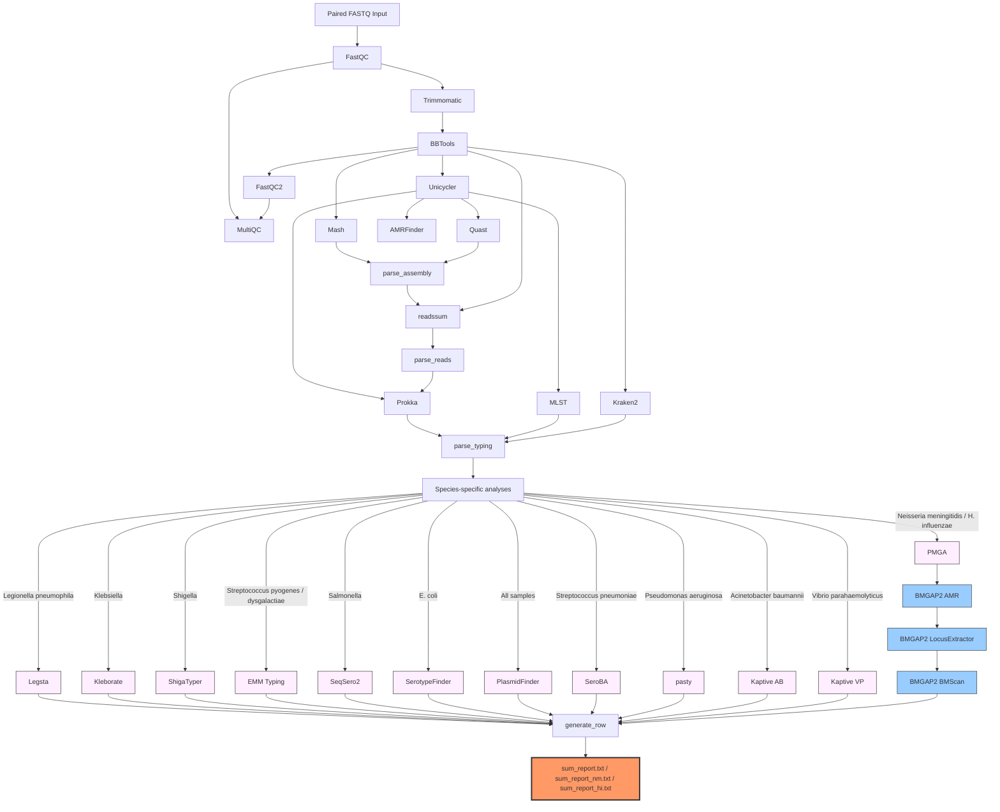

<h1 align="center">Sanibel - Bacterial WGS Analysis Pipeline</h1>

<p align="center">
  <em>⚠️ For research use only. Results were obtained by procedures that were not CLIA validated.</em>
</p>

<p align="center">
  
  
  
  
</p>

## 🦠🧬 Overview

Sanibel is FL-BPHL's Nextflow bacterial whole-genome sequencing (WGS) analysis pipeline. It performs quality control, *de novo* assembly, species identification, sequence typing and antimicrobial resistance (AMR) detection on paired-end Illumina short reads. Species-specific typing modules run automatically based on species identification results: *Legionella pneumophila* (Legsta), *Klebsiella* (Kleborate), *Shigella* (ShigaTyper), *Streptococcus pyogenes/dysgalactiae* (EMM typing), *Salmonella* (SeqSero2), *E. coli* (SerotypeFinder), *Streptococcus pneumoniae* (SeroBA), *Pseudomonas aeruginosa* (pasty), *Acinetobacter baumannii* (Kaptive), *Vibrio parahaemolyticus* (Kaptive), and *Neisseria meningitidis*/*Haemophilus influenzae* (PMGA). BMGAP2 provides enhanced AMR and antigen analysis for *Neisseria meningitidis* and *Haemophilus influenzae*. PlasmidFinder runs on all samples.


## ⚙️ Dependencies

- **Nextflow** ≥ 22.10 — [installation guide](https://github.com/nextflow-io/nextflow)
- **Apptainer/Singularity** — [installation guide](https://apptainer.org/docs/user/latest/)
- **SLURM** workload manager (This applies only if HiPerGator is used)
- **Conda** (for the SANIBEL environment)


## 🛠️ Setup

### 1. Create the conda environment

```bash
$ conda create -n SANIBEL -c conda-forge -c bioconda python=3.10 pandas=1.5.3 openpyxl=3.1.5 biopython=1.78 mash=2.3 blast=2.17.0
$ conda activate SANIBEL
```

`pandas`, `openpyxl`, `biopython`, `mash`, and `blast` are required by the BMGAP2 modules (used for Nm/Hi samples).

### 2. Configure params.yaml

Edit `params.yaml` and set paths for your environment:

```yaml
input:   "/absolute/path/to/fastqs"   # no trailing slash "/"
output:  "/absolute/path/to/output"   # no trailing slash "/"

# BMGAP2 runs automatically for Nm/Hi samples
# HiPerGator users: already configured, no change needed
# Other users: set to your BMGAP2 analysis_scripts directory
bmgap2_db:   "/blue/bphl-florida/share/bmgap2"
```

### 3. Configure sanibel.sh

Set `NXF_APPTAINER_CACHEDIR` to your Singularity/Apptainer image cache directory and add your email address for job notifications:

```bash
export NXF_APPTAINER_CACHEDIR=/path/to/singularity/cache
#SBATCH --mail-user=your@email.gov
```

## BMGAP2 Setup

> **HiPerGator users:** BMGAP2 is already installed and configured on the cluster. The `bmgap2_db` path in `params.yaml` is pre-set. Skip this section entirely.

[BMGAP2](https://github.com/CDCgov/BMGAP2) (*Bacterial Meningitis Genome Analysis Pipeline 2*) runs automatically on every sample. The Python scripts it invokes check the MLST scheme internally and skip any sample that is not *N. meningitidis* or *H. influenzae*, so no configuration flag is needed.

For non-HiPerGator users, BMGAP2 must be installed before running the pipeline. Its scripts run directly on the host (not inside a container) and are invoked by the three `bmgap2_*` Nextflow modules. Follow the [BMGAP2 installation instructions](https://github.com/CDCgov/BMGAP2) to clone the repository and build all required databases, then set `bmgap2_db` in `params.yaml` to the `analysis_scripts` directory.


## How to Run

Place input FASTQ files in the directory specified by `params.input`. Both naming conventions are supported:

| Convention | Example |
|------------|---------|
| Illumina native | `SAMPLE_S1_L001_R1_001.fastq.gz` |
| Simplified | `SAMPLE_1.fastq.gz` |


## 🐊 HiPerGator Usage
```bash
sbatch sanibel.sh
```

## ⚡ Local Usage
```bash
nextflow run sanibel.nf -profile apptainer -params-file params.yaml
```

## Workflow Diagram



### Modules

| Module | Tool | Purpose |
|--------|------|---------|
| `fastqc` | FastQC 0.12.1 | Raw read quality |
| `trimmomatic` | Trimmomatic 0.40 | Adapter trimming |
| `bbtools` | BBTools 39.77 | Adapter and PhiX removal |
| `fastqc2` | FastQC 0.12.1 | Post-trim read quality |
| `multiqc` | MultiQC 1.33 | Per-sample QC report |
| `mash` | Mash 2.3 | Species identification |
| `unicycler` | Unicycler 0.5.1 | *De novo* assembly |
| `kraken` | Kraken2 2.17.1 | Read-based species classification |
| `quast` | QUAST 5.3.0 | Assembly quality metrics |
| `parse_assembly` | Python | Parse Mash + QUAST → pyoutputs |
| `readssum` | Lyveset 2.0.1 | Read metrics |
| `parse_reads` | Python | Append read metrics → pyoutputs |
| `prokka` | Prokka 1.15.6 | Genome annotation |
| `amrfinder` | AMRFinderPlus 4.2.7 | AMR gene detection |
| `mlst` | MLST 2.32.2 | Sequence typing |
| `pmga` | PMGA 3.0.2 | *Neisseria*/*H. influenzae* antigen typing |
| `parse_typing` | Python | Merge typing results → pyoutputs |
| `bmgap2_amr` | BMGAP2 | Mutation-based AMR profiling *(Nm/Hi only — Python self-gates)* |
| `bmgap2_locusextractor` | BMGAP2 | Vaccine antigen identification *(Nm/Hi only — Python self-gates)* |
| `bmgap2_bmscan` | BMGAP2 | Species confirmation *(Nm/Hi only — Python self-gates)* |
| `legsta` | Legsta 0.5.1 | *Legionella pneumophila* typing |
| `kleborate` | Kleborate 3.2.4 | *Klebsiella* K/O loci, virulence, AMR |
| `shigatyper` | ShigaTyper 2.0.5 | *Shigella* serotyping |
| `emm_typing` | emm-typing-tool 0.0.1 | Group A *Streptococcus* emm typing |
| `seqsero2` | SeqSero2 1.3.2 | *Salmonella* serotyping |
| `serotypefinder` | SerotypeFinder 2.0.2 | *E. coli* serotyping |
| `plasmidfinder` | PlasmidFinder 3.0.3 | Plasmid detection (all samples) |
| `seroba` | SeroBA 2.0.5 | *Streptococcus pneumoniae* serotyping |
| `pasty` | pasty 2.2.1 | *Pseudomonas aeruginosa* serogroup typing |
| `kaptive_ab` | Kaptive 3.2.0 | *Acinetobacter baumannii* K/OC locus typing |
| `kaptive_vp` | Kaptive 3.2.0 | *Vibrio parahaemolyticus* K/O locus typing |
| `generate_row` | Python | Compile per-sample report row |
| `summary_report` | Python | Merge all rows → `sum_report*.txt` |

## 📁 Output

All per-sample results are written to `params.output/<sample_id>/`. Depending on which species are in the run, up to three summary files are written to `params.output/`:

**`sum_report.txt`** — 20 columns shared by all standard samples:
`sampleID`, `num_clean_reads`, `avg_readlength`, `avg_read_qual`, `est_coverage`, `num_contigs`, `longest_contig`, `N50`, `L50`, `total_length`, `gc_content`, `annotated_cds`, `speciesID_mash`, `nearest_neighbor_mash`, `mash_distance`, `speciesID_kraken`, `kraken_percent`, `mlst_scheme`, `mlst_st`, `serotype`

**`sum_report_nm.txt`** — 45 columns (*N. meningitidis*):
All standard fields plus `mlst_cc`, `pmga_species`, `nm_serogroup`, `serotype_notes`, and BMGAP2 fields: `bmgap2_species`, `bmgap2_mlst_st/cc`, `predicted_resistance`, `penA_allele/mutations/phenotype`, `gyrA_allele/mutations/phenotype`, `parC_allele/phenotype`, `rpoB_allele/phenotype`, `ponA_allele/phenotype`, `FHbp_variant/subfamily/peptide`, `NadA_variant`, `NhbA_peptide`, `vaccine_4CMenB_coverage`. BMGAP2 columns are populated for Nm samples; otherwise `No data`.

**`sum_report_hi.txt`** — 41 columns (*H. influenzae*):
All standard fields plus `mlst_cc`, `pmga_species`, `hi_serotype`, `serotype_notes`, and BMGAP2 fields: `bmgap2_species`, `bmgap2_mlst_st/cc`, `predicted_resistance`, `ftsI_allele/mutations/phenotype`, `gyrA_allele/mutations/phenotype`, `parC_allele/phenotype`, `rpoB_allele/phenotype`, `folA_allele/phenotype`, `blaTEM1_status`, `blaROB1_status`. BMGAP2 columns are populated for Hi samples; otherwise `No data`.


## 🤝 Contributing
We welcome contributions to make Sanibel better! Feel free to open issues or submit pull requests to suggest any additional features or enhancements!

## 📧 Contact
**Email**: bphl-sebioinformatics@flhealth.gov

## ⚖️ License
Sanibel is licensed under the [Apache License ](https://github.com/BPHL-Molecular/Sanibel/blob/main/LICENSE).
