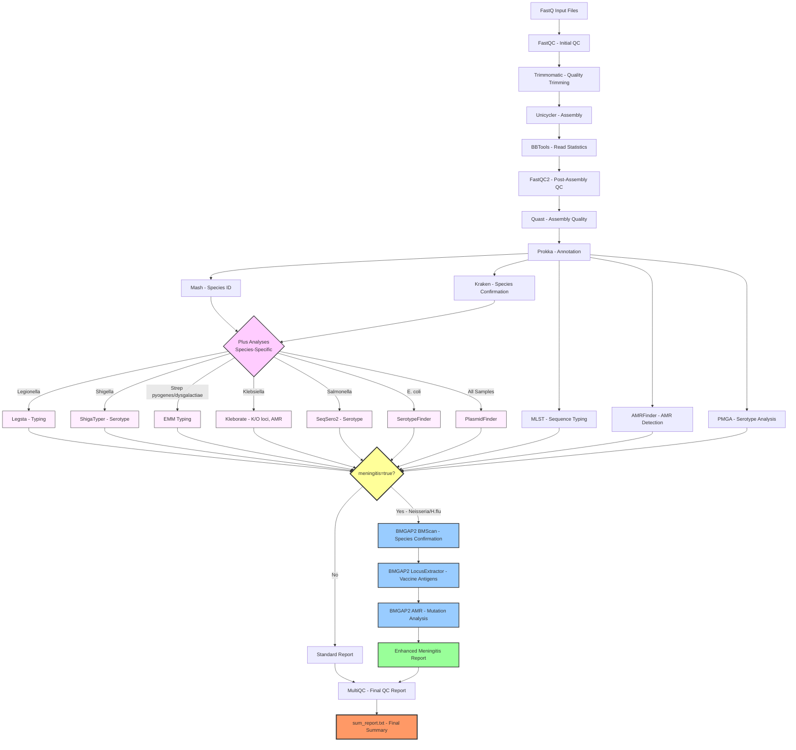

<h1 align="center">Sanibel</h1>

## Overview
The Nextflow pipeline is used to analyze NGS data in fastq format from the bacterial genome. It is a Nextflow version of the Flaq_amr pipeline (FL-BPHL's standard bacterial assembly pipeline with AMR detection). Compared with Flaq_amr, Sanibel significantly reduces runtime and is especially suitable for analysis of large sample sizes. In addition, some additional analyses of Neisseria, H.influenzae, Legionella, Shigella, group A strep, Klebsiella, Salmonella, E.coli, and plasmid are added, such as identifying clonal complex and serotype of Neisseria and H.influenzae species.

**BMGAP2 Integration:** Sanibel includes optional integration with BMGAP2 (Bacterial Meningitis Genome Analysis Pipeline 2) for enhanced analysis of meningitis pathogens (*Neisseria meningitidis* and *Haemophilus influenzae*). When enabled with the `--meningitis` parameter, BMGAP2 modules provide:
- Species confirmation via BMScan
- Vaccine antigen identification through LocusExtractor
- Comprehensive mutation-based antimicrobial resistance profiling
- Additional meningitis-specific reporting fields (45 columns vs. 23 standard columns)


## Workflow Overview



**Key Features:**
- **Standard Pipeline** (all samples): QC → Assembly → Species ID → MLST → AMR → Serotyping
- **Plus Analyses** (species-specific, highlighted in pink):
  - Legionella: legsta typing
  - Shigella: ShigaTyper serotyping
  - Group A Strep: emm typing
  - Klebsiella: Kleborate (K/O loci, virulence, AMR)
  - Salmonella: SeqSero2 serotyping
  - E. coli: SerotypeFinder
  - All samples: PlasmidFinder
- **BMGAP2 Integration** (when `--meningitis true`, highlighted in blue):
  - BMScan: Confirms Neisseria/H.influenzae species
  - LocusExtractor: Identifies vaccine antigens and resistance mutations
  - BMGAP2 AMR: Detailed mutation-based resistance profiling
- **Output**: 23 columns (standard) or 45 columns (with BMGAP2) in final report

## Prerequisites
Nextflow is needed. The details of installation can be found at https://github.com/nextflow-io/nextflow.

Python3 is needed. The package "pandas" should be installed by ``` pip3 install pandas ``` if not included in your python3.

Singularity/APPTAINER is needed. The details of installation can be found in https://singularity-tutorial.github.io/01-installation/.

SLURM is needed.

## Recommended conda environment installation
   ```bash
   conda create -n SANIBEL -c conda-forge -c bioconda python=3.10 pandas=1.5.3 openpyxl=3.1.5 biopython=1.78 mash=2.3 blast=2.17.0
   ```
   ```bash
   conda activate SANIBEL
   ```

**Note:** `pandas`, `openpyxl`, `biopython`, `mash`, and `blast` are required for BMGAP2 meningitis modules (AMR mutation analysis, vaccine antigens, species identification). BMGAP2 requires `biopython=1.78` (matches BMGAP2's environment specification).
## How to run

### Option1, your data file names directly come from Illumina output: 
1. put your data files into the directory /fastqs. Your data file's name should look like "XZA22002292-XS-ASX550430-220701_S143_L001_R1_001.fastq.gz". 
2. open the file "params.yaml", and set the two parameters absolute paths. They should be ".../.../fastqs" and ".../.../output". 
3. get to the top directory of the pipeline, run 
```bash
sbatch ./sanibel_illumina.sh
```
### Option2, your data file names do not directly come from Illumina output: 
1. put your data files into the directory /fastqs. Your data file's name should look like "XZA22002292_1.fastq.gz", "XZA22002292_2.fastq.gz" 
2. open the file "params.yaml", and set the two parameters absolute paths. They should be ".../.../fastqs" and ".../.../output". 
3. get into the directory of the pipeline, run 
```bash
sbatch ./sanibel.sh
```

## By Docker
By default, the pipeline uses singularity to run containers and is wrapped by SLURM. If you want to use docker to run the containers, you should use the command below:
If your data file names do not directly come from Illumina output,
```bash
sbatch ./sanibel_docker.sh
```
If your data file names directly come from Illumina output,
```bash
sbatch ./sanibel_illumina_docker.sh
```

## Version updates
    https://github.com/BPHL-Molecular/Sanibel.wiki.git

#### Note1: some sample data files can be found in the directory /fastqs/sample_data. If you want to use these data for the pipeline test, please copy them to the directory /fastqs.
#### Note2: If you want to get email notification when the pipeline running ends, please input your email address in the line "#SBATCH --mail-user=<EMAIL>" in the batch file that you will run (namely, sanibel.sh, sanibel_illumina.sh, sanibel_docker.sh, or sanibel_illumina_docker.sh). 

