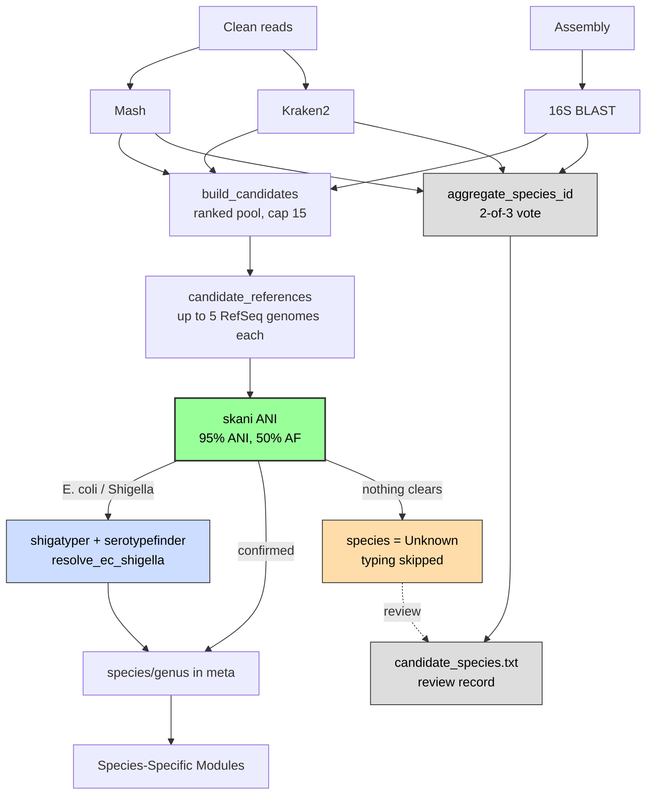

# Species identification

Sanibel identifies a sample by whole-genome average nucleotide identity (ANI). Mash, Kraken2 and
16S BLAST nominate candidate species, Sanibel downloads reference genomes for every
candidate and skani compares the assembly against all of them. The best reference that
clears both thresholds (ANI score and alignment) is the identification and it decides which species-specific
modules run.

The three nominating tools are not competing answers to choose between. Their job is to
make sure the correct genome ends up in the pool for skani to test. A 2-of-3 vote across
the same three tools is also written to `candidate_species.txt`, but only as a review
record for the case where skani clears nothing.

Code referenced here lives in [`sanibel.nf`](../sanibel.nf), the `candidate*` / `*species*`
/ `skani` modules and two scripts in [`bin/`](../bin). Every threshold links to the
constant that defines it, so a change in the code surfaces the doc in the same review.

## Candidate nomination

Every sample produces three independent identifications from the cleaned reads and the
assembly:

| Source | Module | What it reports |
| ------ | ------ | --------------- |
| Mash | `mash` then `parse_assembly` | Closest RefSeq sketch (genus, species, accession, distance) |
| Kraken2 | `kraken` | Read-level classification (genus, species, % reads) |
| 16S rRNA BLAST | `blast_16s` | Top 16S hits against the NCBI rRNA 16S DB (genus, species, %identity) |

A 16S hit only counts toward ID once it clears
[**400 bp and 97% identity**](../bin/sanibel_taxonomy.py#L12-L13) and only resolves to
species rather than genus at [**98.7% identity**](../bin/aggregate_species_id.py#L24).

## Building the candidate pool

`build_candidates` ([module](../modules/build_candidates.nf),
[script](../bin/build_candidate_pool.py)) merges the three nominations into a ranked list
rather than a single winner:

- Each tool's [top 3](../bin/build_candidate_pool.py#L30) is seeded into the pool whether
  or not the others agree (Mash by distance, Kraken2 by reads, 16S by %identity).
- Remaining slots fill by number of supporting tools (desc), then Mash distance (asc),
  then 16S %identity (desc).
- The pool is capped at [**15**](../bin/build_candidate_pool.py#L31) candidates.

Seeding each tool's top hits regardless of corroboration is deliberate. An uncorroborated
Mash hit is still a genome worth testing and dropping it would keep skani from ever
evaluating the closest reference.

[Kraken2 candidates](../bin/build_candidate_pool.py#L26-L28) are kept when they clear an
adaptive threshold (the larger of 15% of the top species or 5%) with at least 10 reads,
plus one "foreign" top hit for each genus not already represented. That foreign hit is one way how
a possible contaminant reaches the pool.

## Downloading references

`candidate_references` ([module](../modules/candidate_references.nf)) requests
[**5 RefSeq genomes per candidate**](../modules/candidate_references.nf#L14) with NCBI
`datasets` and then adds the Mash sketch representative when one is known, so a candidate
yields six genomes if that representative was not already among the five. Genomes land
in a per-sample directory as `species__accession.fna`. The process fails only when it pulls
zero genomes across every candidate. The genomes are not published, only a manifest of what
skani saw.

## Confirming by ANI

`skani` ([module](../modules/skani.nf)) runs `skani dist` of the assembly against every
downloaded reference, sorts by ANI and takes the top hit. That one hit must then clear
[**95% ANI and 50% aligned fraction**](../modules/skani.nf#L14-L15). If it does not, nothing
is emitted, even when a lower-ranked reference would have qualified. The species half of the
surviving reference filename becomes `{id}_skani_species.txt`.

This is the identification for every genus except *Escherichia* and *Shigella*, which get
one more step below. Everything downstream keys on it.

Back in [`sanibel.nf`](../sanibel.nf#L210-L216), the confirmed species is joined onto each
sample's metadata (`ch_meta_prov`), defaulting to `Unknown` when skani returned nothing:

```groovy
ch_meta_prov = ch_meta_by_id
    .join(ch_skani.species.map { meta, f -> [ meta.id, f.text.trim() ] }, remainder: true)
    .map { id, meta, sp -> [ id, meta + [ species: sp ?: 'Unknown', genus: ... ] ] }
```

Every species-specific module filters on `meta.species` or `meta.genus` from that call:
`seqsero2` on *Salmonella*, `lissero` on *L. monocytogenes* and the rest.

## Escherichia and Shigella

*E. coli* and *Shigella* spp. are one genomospecies. References across that complex sit
around 97% ANI of each other, so skani's ranking there reflects which reference reached the
pool rather than which organism the sample is. A sample can top out on *S. sonnei* by three
hundredths of a point over *E. coli* and still be *E. coli*.

So skani's call is provisional for this complex only. `inComplex` in
[`sanibel.nf`](../sanibel.nf#L59-L61) selects it, `species == Escherichia_coli` or
`genus == Shigella`. *E. fergusonii*, *E. albertii* and *E. marmotae* sit near 91-92% ANI
and stay out. Both `shigatyper` and `serotypefinder` then run on every selected sample,
and [`resolve_ec_shigella`](../modules/resolve_ec_shigella.nf) reads the ShigaTyper
prediction:

| Prediction contains | Resolved genus |
| ------------------- | -------------- |
| `Not Shigella or EIEC` | Escherichia |
| `Shigella` | Shigella |
| `EIEC` | Escherichia |
| anything else | no change |

SerotypeFinder does not vote. It detects `wzx`/`wzy`/`fliC`, and Shigella carry O antigens
shared with *E. coli*, so it returns an O:H call either way. Its result fills the
`serotype` column on the *Escherichia* branch; ShigaTyper's prediction fills it on the
*Shigella* branch.

With the genus fixed, [`resolve_ec_shigella.py`](../bin/resolve_ec_shigella.py) re-reads
the skani TSV under the same 95 ANI / 50 aligned fraction gate and takes the highest-ANI
row whose species matches ShigaTyper's named species, or failing that the highest-ANI row
in the resolved genus. Nothing changes when neither exists, or when the row it picks is
already skani's top hit. That species name is what reaches `meta.species`, and
[`apply_resolved_species`](../bin/summary_report.py) re-points `skani_species`, `skani_ani`,
`skani_align_fraction` and `skani_reference` at the same row, so all four describe one
reference. The `blast_16s_tophit` anchor and the contamination anchor follow the resolved
genus.

## When skani cannot confirm

Two gates use the same 95 / 50 numbers and they do not behave identically:

- [`skani.nf`](../modules/skani.nf#L24) applies a hard cut. Below 95% ANI or 50% aligned
  fraction the species file is empty, `meta.species` becomes `Unknown` and species-specific
  typing is skipped.
- [`compute_id_qc`](../bin/summary_report.py#L242-L256) adds a review band when it labels
  `species_id_qc`: `PASS` at 95% ANI or better, `REVIEW (borderline ANI)` from 94 up to 95,
  and `NO ID` below that or whenever aligned fraction is under 50.

So a sample at 94.5% ANI reads `REVIEW (borderline ANI)` in the summary but still gets no
typing, because skani already declined to name it. Note also that the `NO ID` label always
names ANI even when aligned fraction is the criterion that failed.

For these samples the 2-of-3 vote is the record to review. `aggregate_species_id`
([module](../modules/aggregate_species_id.nf),
[script](../bin/aggregate_species_id.py)) always runs and always publishes it; it does not
matter when skani succeeded. It collapses the three nominations into one row:

```text
genus  species  confidence  evidence
```

- Genus is the majority genus across the three tools. Species is the majority species
  among the tools that agreed on that genus.
- [Confidence](../bin/aggregate_species_id.py#L121) is `high` when all three agree on
  genus and species, `medium` when two agree, `low` otherwise. A `low` result is reported
  as `Inconclusive`.
- `evidence` shows what each tool called, so a disagreement is visible directly.

This row is published per sample as `<id>_candidate_species.txt`. It does not feed the
summary report and drives no downstream module.

## Contamination flag

Contamination is reported once, in `sum_report.txt` and is computed by
[`summary_report`](../bin/summary_report.py), not by the vote.
[`detect_contamination`](../bin/sanibel_taxonomy.py#L145-L184) keeps the best 16S hit per
contig, each clearing [**99% identity over 1400 bp**](../bin/sanibel_taxonomy.py#L8-L9), then
flags the sample when two of those contigs carry different genera whose subject ranges
overlap. Genus pairs registered as synonyms are suppressed. The genus reported as the
contaminant is the one in that overlapping pair that is not the skani-confirmed genus, so
two high-identity genera sitting on non-overlapping regions do not raise a flag.

## Data flow


